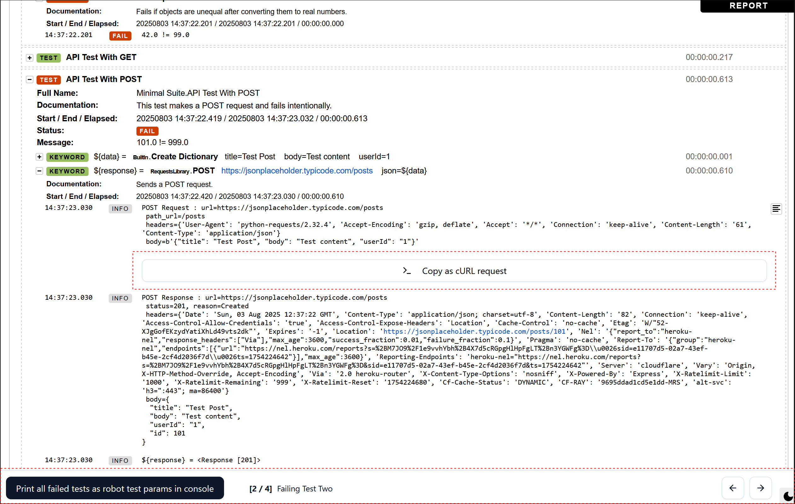
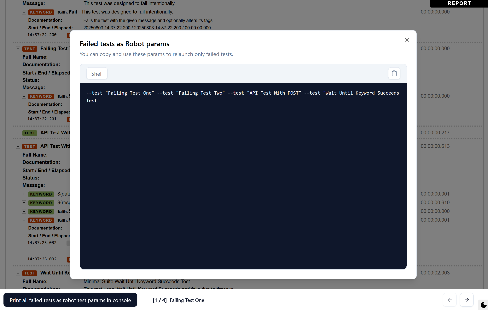
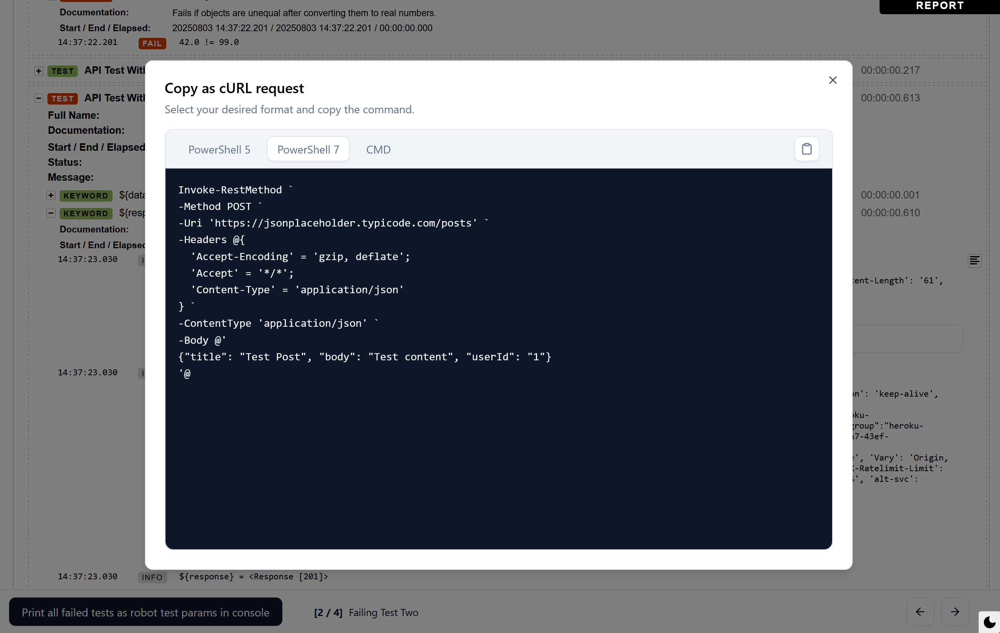

# Robot Log Enhancer

This is a simple but powerful client-side tool that supercharges the `log.html` files generated by Robot Framework. It injects a set of features directly into the log page to make debugging and analyzing test results way easier.



## Features

- **Interactive Footer UI**:
  - **Test Navigator**: Adds a footer that shows the current failed test (`[1/4]`) and lets you jump between them instantly with next/previous buttons or your keyboard's left/right arrow keys.
  - **Rerun Failed Tests**: A simple button that pops up a dialog with the exact `robot` command arguments needed to rerun only the tests that failed. Just copy, paste, and run.



- **Reproduce API Requests Instantly**:
  - Automatically adds a "Copy as cURL" button to every Robot Framework `RequestsLibrary` action in your log.
  - Clicking it opens a modal with the request ready to be copied for PowerShell 5, PowerShell 7, and Windows CMD.



- **Seamless Integration**:
  - The UI automatically detects and matches the Robot log's light or dark theme.
  - Cleans up the log by collapsing "Wait Until Keyword Succeeds" blocks to only show the final, relevant attempt.

## How to Use

The goal is to inject this tool's compiled JavaScript into your `log.html` file.

1.  **Build the project**:

    ```
    yarn install
    yarn run build
    ```

    This creates a single file at `dist/robot-log-enhancer.umd.js`.

2.  **Inject into `log.html`**:
    The easiest way is to use the provided PowerShell script.
    - Place your `log.html` file in the `.\test-injection\` directory.
    - Run the script:
      ```
      .\test-injection\inject.ps1
      ```
    - This will create a new `log.injected.html` file. Open it in your browser to see the new features.

    Alternatively, you can manually add the following script tag just before the closing `</body>` tag in your `log.html` file, making sure to use the correct path to the `.js` file.

    ```
    <script src="C:\path\to\your\project\dist\robot-log-enhancer.umd.js"></script>
    ```

## How it Works

This tool is built with Svelte and compiled into a single JavaScript file. When injected, it:

1.  Uses **Web Components** to add its UI (the footer, dialogs, etc.). This keeps its styles and logic safely sandboxed from the original page.
2.  Overrides a couple of the default Robot log JavaScript functions to add its features and clean up the view.
3.  Observes the page's DOM to find failed tests and REST API calls, injecting its components where they're needed.

## Tech Stack

This project is built with a modern, efficient stack:

- **Svelte 5:** For a reactive and component-based UI.
- **Tailwind CSS v4:** For utility-first styling.
- **shadcn-svelte:** For a set of accessible and reusable UI components.

## Development

Want to tinker with the code?

1.  Clone the repo and install dependencies:

    ```
    git clone https://github.com/your-username/robot-log-enhancer.git
    cd robot-log-enhancer
    yarn install
    ```

2.  Run the dev server:
    ```
    yarn run dev
    ```
    Vite will open a browser window with your `index.html` and hot-reload any changes you make to the code.

You can dev on a custom robot `log.html` file, just replace current `index.html`and inject this in the body:

```html
<script type="module" src="/src/main.ts"></script>
```

## License

This project is licensed under the FreeBSD/BSD 2-Clause License.
