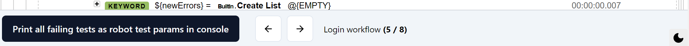
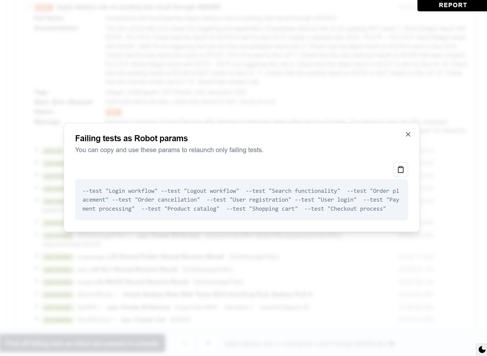

# Robot Log Enhancer 🤖

Robot Log Enhancer is a JavaScript module designed to enhance the log.html files generated by [Robot Framework](https://github.com/robotframework/robotframework). It adds a footer to the log page and provides additional functionality to improve the test result analysis experience.



This is a fork of https://github.com/brequet/robot-log-enhancer-module.

## Features

- Automatically collapses all children of the "Wait Until Keyword Succeeds" keyword except for the last one, focusing on the final failing example.
- Adds navigation buttons to move between failing tests (previous/next), with keyboard support (left/right arrow keys).
- Includes a button to open a modal that allows copying failing tests as command-line arguments, making it easy to rerun only the failed tests.



## Installation

1. Clone the repository:

   ```
   git clone https://github.com/your-username/robot-log-enhancer.git
   cd robot-log-enhancer
   ```

2. Install dependencies:

   ```
   yarn install
   ```

3. Build the module:
   ```
   yarn run build
   ```

This will create the `dist/robot-log-enhancer.umd.js` file.

## Usage

To use the Robot Log Enhancer in your Robot Framework log.html file, you need to import the JavaScript module. You can do this by adding a script tag to the log.html file, either with the content of the generated script or with a path to the JS file.

Example:

```html
<script src="C:\path\robot-log-enhancer-module\dist\robot-log-enhancer.umd.js"></script>
```

Make sure to adjust the path according to your project structure.

## Development

This project is built using the following technologies:

- Vite
- Svelte
- Tailwind CSS
- shadcn/ui

To set up the development environment, follow the installation steps above. You can then use Vite's development server to work on the project.

To test your development, simply import the path to the generated JS module in your log.html file, rebuild and refresh the page to see the changes.

## Contributing

Contributions are welcome! Please feel free to submit a Pull Request.

## License

This project is licensed under the FreeBSD/BSD 2-Clause License.
